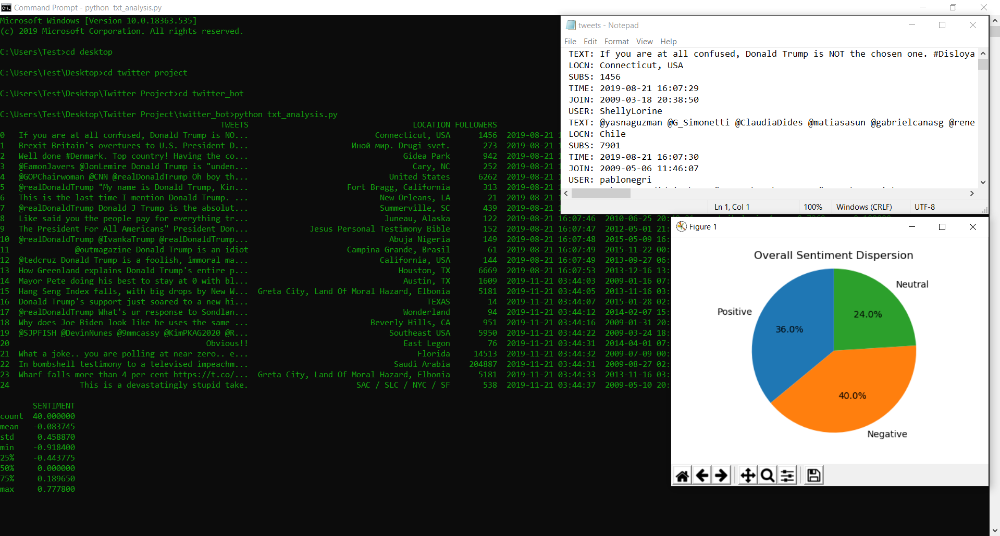
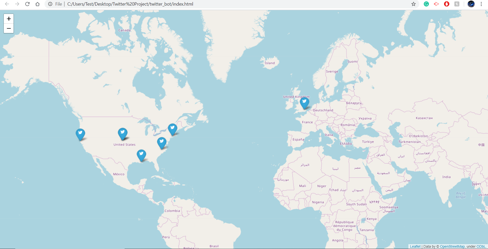
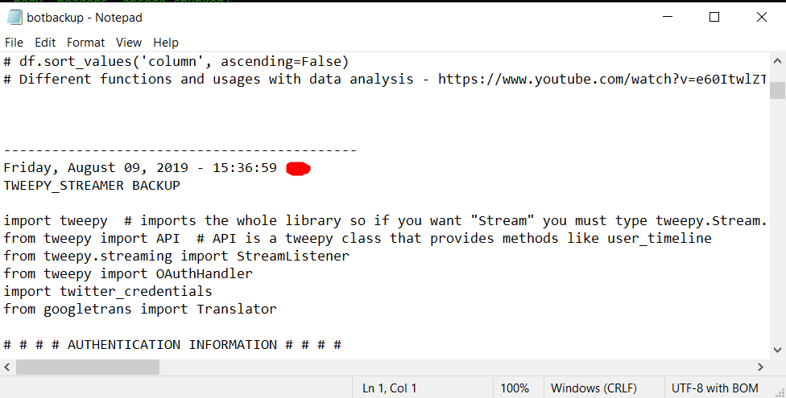

# SentimentAnalysisBot
Sentiment Analysis using tweet streams as data + mapping/graphical visualization.

•	A script that streams realtime encoded data, parses information, uses translation API to support all languages, and includes a backup system
•	Analyzes data for sentiment rating through NLP implementation and organized objects into a data structure for easier analysis and visualization

CMD Example: 

CMD + Graph:

Map Demo: 

Backup:

