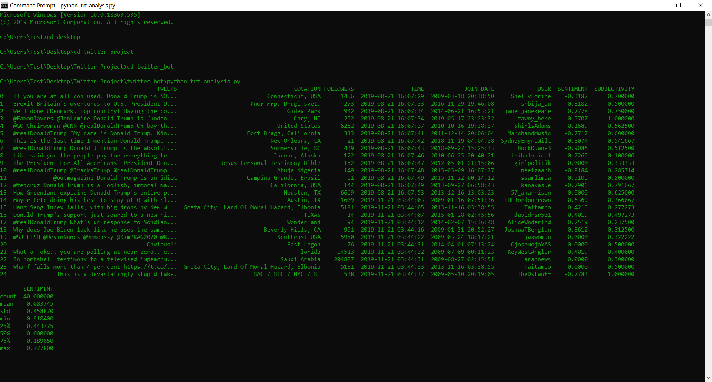

# SentimentAnalysisBot

### Sentiment Analysis using tweet streams + graphical visualization.

**•	A script that streams realtime encoded data, parses information, uses translation API to support all languages, and includes a backup system

**•	Analyzes data for sentiment rating through NLP implementation and organizes object for easier analysis and visualization

CMD Example: 

CMD + Graph:

Map Demo: 

Backup:

